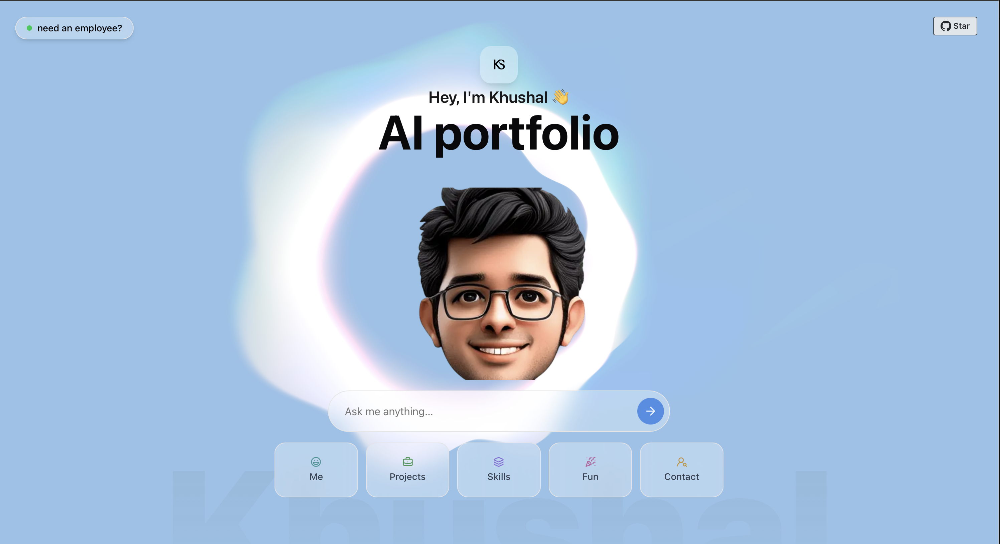

# 🤖 Khushal Sharma — Interactive Portfolio

This isn't just a portfolio — it's a **conversation**.

Welcome to my AI-powered digital twin: a chat-driven experience that talks like me, thinks like me, and maybe even throws in a sarcastic comment or two. Whether you're a recruiter, collaborator, or just curious, you can chat with my portfolio to get answers as if I were right there — minus the caffeine dependency.

> 🔗 **Try it out:** [khushalrs-portfolio](https://khushalrs-portfolio.netlify.app/)

---

## 🗣️ What Can You Do Here?

- 🔍 Ask about my projects, research, or thesis
- 🧠 Get answers in my voice — informed, chill, and slightly opinionated
- 🤝 Discover my skills, interests, and what I bring to the table
- 😏 Get a feel for how I think and work — beyond a static résumé

---

## ⚙️ Behind the Scenes

The portfolio is powered by a custom GPT-based assistant that reflects:
- My tone
- My background
- My personality

---

## 🤝 Let's Connect

If the portfolio AI doesn’t win you over, feel free to reach out directly:

- 💼 LinkedIn: [khushal-sharma](https://linkedin.com/in/khushal-sharma)

---

_“AI won’t take your job — but mine might help you do yours faster.”_

